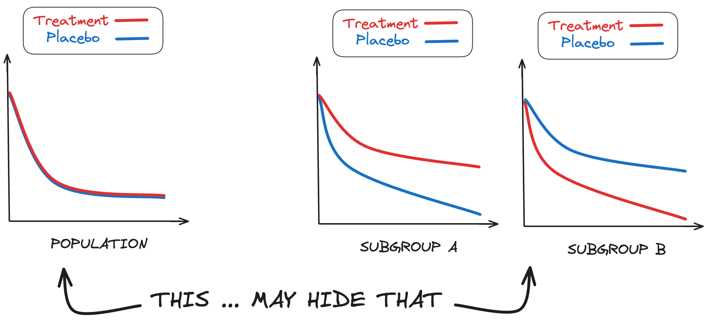

<div align="center">
<h1>Heterogeneity of treatment effect (hte)</h1>
</div>

Time-to-event subgroup analysis for randomized control trials




## A- Installation

```
git clone https://github.com/owkin/hte.git
```

Then:
```
conda create -n hte python=3.9
conda activate hte
pip install "poetry==1.5.1"
poetry install
```


## B- Running a benchmarking experiment from the command line

### Step 1 - Set up data configs: define the parameters and experiment settings 

Generate experiment parameters, for one subgroup definition in `configs/data_configs/subgroups.py` and a chosen dimension and prognostic configuration, by running:

```
configs/data_configs/generate_parameters.py
```

To add a new subgroup function:
- Add the subgroup function definition in `configs/data_configs/subgroups.py`
- Add the new subgroup function name to the `subgroup_index_dict` in `configs/data_configs/subgroups.py`

Parameter settings from LINK PAPER are available in `configs/data_configs` folder. Currently the existing parameter settings are:
- Dimension p=20, isotropic, 10 prognostic covariates (5 positive, 5 negative) : `dim20_isotropic_pro(+)5_pro(-)5.json`
- Dimension p=100, isotropic, 10 prognostic covariates (5 positive, 5 negative), 50 noise covariates : `dim100_isotropic_pro(+)5_pro(-)5_noise50.json`
- Dimension p=1000, isotropic, 20 prognostic covariates (10 positive, 10 negative), 500 noise covariates : `dim1000_isotropic_pro(+)10_pro(-)10_noise500.json`

### Step 2 - Generate the data using the DGP

Create, if needed, a `results_compute_arr` folder in the `data` folder.

Generate data respecting heterogeneity conditions by running the following when located in the `experiments` folder:

```
python launch_compute_arr.py [–h] [-f FILE] [-g GROUP] [-l MINVAL] [-u MAXVAL] [-n NBPOINTS] [-mc MONTECARLO] [-m MODEL] [-ha HAZARD] [-a A] [-b B] [-tp TIMEPOINT] [-ss SEMI_SYNTH] 
```

Where 
- `-FILE`: the path to the parameter settings file produced in step 1;
- `GROUP`: name of the subgroup function defined in `configs/data_configs/subgroups.py`, of the form `dim<P>_pred<X>_prog<Y>_balanced`;
- `MINVAL`: the lowest value of $\beta$ to consider.
- `MAXVAL`: the highest value of $\beta$ to consider.
- `NBPOINTS`: the number of $\beta$ points for which to generate ARR.
- `MONTECARLO`: Monte Carlo sampling size. Defaults to 1e6
- `MODEL`: Name of the time-to-event model {Cox, AH, AFT}. Defaults to Cox
- `HAZARD`: Name of the baseline hazard {Weibull, LogNormal}. Defaults to Weibull
- `A`: First parameter of the baseline hazard. Defaults to 1.
- `B`: Second parameter of the baseline hazard. Defaults to 2.
- `TIMEPOINT`: The timepoint where the ARR is computed. Defaults to 1.
- `SEMI_SYNTH`: whether to use semi-synthetic data {True, False}. Defaults to False.

Data generated used in LINK PAPER are available in `data/results_compute_arr` as a json file with a naming of the form `Cox_Weibull_1.0_2.0_<MONTH>_<MONTH-NUMBER>_<DAY>_<YEAR>_<HH:MM:SS>----nbpoints=<NBPOINTS>--minval=<MINVALD>--maxval=<MAXVAL>.json`.

### Step 3 - Run experiments

Create, if needed, `results_expe/raw_results/` and `results_expe/processed_results/` folders in the `experiments` folder.

Run experiments by running the following when located in the `experiments` folder:

```
python launch_expe.py [-h] [-f FILE] [-n NBPOINTS] [-s SAMPLESIZE] [-tr TRAINSIZE] [-r REPET] [-c CENSORED] [-sc SCALE] [-ss SEMI_SYNTH] [-m METHODS]
```

Where
- `FILE`: the path to the generated data file produced in step 2.
- `NBPOINTS`: the number of ARR points to run the experiment for.
- `SAMPLESIZE`: the sample size.
- `TRAINSIZE`: the proportion of samples assigned to the training set out of `SAMPLESIZE`;
- `REPET`: the number of experiment repeats at each ARR point;
- `CENSORED`: whether there is censorship {True, False}. Defaults to False.
- `SCALE`: the censorship scenario {1, 2, 3} (as defined in LINK PAPER). Defaults to 1.
- `SEMI_SYNTH`: whether to use semi-synthetic data {True, False}. Defaults to False.
- `METHODS`: list (as string) of methods to benchmark. Defaults to "Oracle, Univariate interaction, Univariate t_test, Multivariate cox, Multivariate tree, MOB, ITree, ARDP".

Experiment results are stored in `experiments/results_expe/raw_results/` and `experiments/results_expe/processed_results/` as two csv files with the same naming, of the form `Cox_Weibull_1.0_2.0_dim=<DIMENSION>_range=[<MINVAL>,<MAXVAL>]_nb=<NBPOINTS>_group=[<GROUP>]_rangeARR=[<LOWER-BOUND-ARR>, <UPPER-BOUND-ARR>]_nb=<NBPOINTS>_train=<TRAINSIZE>_test=<TESTSIZE>_repet=<REPET>_censored=<CENSORED>_scale=<SCALE>_<MONTH>_<MONTH-NUMBER>_<DAY>_<YEAR>_<HH:MM:SS>.csv`.

## C- Adding a new method to benchmark

To add an additional method to the benchmark, follow the template in `hte/models/method_template.py`. The new method should be a class and have at least the following functions:
- A fit(**args) method
- A pval_hte(**args) method returning the p-value corresponding to the model estimation of heterogeneity existence
- A variables_ranking(**args) method returning a ranking of variables based on their estimated contribution to heterogeneity
- A predict(**args) returning the good/bad responders group assignment (0 or 1)

Additionally:
- The file containing the new method class definition should be placed in `hte/models`
- Import the new method in `hte/experiments/run_experiments`
- Set up the new method attributes in `hte/experiments/attributes.py`

Follow the steps in B. In step B-3, use the command line and modify the `[-m METHODS]` argument to add the new method accordingly.

## D- Benchmarking experiment analysis

Raw and processed results are available in `experiments/results_expe` folder. 
In the same folders, analysis files are available; they can be converted to .ipynb notebooks using the following command:

```jupytext --to notebook analysis_rq1.py```

will create a analysis_rq1.ipynb file. 
The notebooks can be run to recreate the figures of our [LINK PAPER], as well as producing exploration tables for the different experiment scenarios and research questions.

## Example - Running a benchmarking experiment in dimension p=20

### Step 1

The parameter settings stored in `dim20_isotropic_pro(+)5_pro(-)5.json` are used.

### Step 2

Data is generated for a subgroup with 4 predictive variables and no prognostic variables, for 500 values of $\beta$ between -10 and 10, when located in the `experiments` folder:

```
python launch_compute_arr.py -f="../configs/data_configs/dim20_isotropic_pro(+)5_pro(-)5.json" -g="dim20_pred4_prog0_balanced" -l=-10. -u=10. -n=500
```

This step reproduces the following file, available in `data/results_compute_arr` folder: `Cox_Weibull_1.0_2.0_dim=20_range=[-10.0,10.0]_nb=500_group=[dim20_pred4_prog0_balanced]_July_07_12_2023_15:15:24.json`

### Step 3

Experiments are run for 10 points of ARR, with 100 repeats per ARR, with a sample size of 500 and 50-50 train-test split, following censorship scenario (1), when located in the `experiments` folder:

```
python launch_expe.py -f="../data/results_compute_arr/Cox_Weibull_1.0_2.0_dim=20_range=[-10.0,10.0]_nb=500_group=[dim20_pred4_prog0_balanced]_July_07_12_2023_15:15:24.json" -n=10 -s=500 -tr=0.5 -r=100 -c=True -sc=1.0 -m="Oracle, Univariate interaction, Univariate t_test, Multivariate cox"
```

This step reproduces the following file, available in `experiments/results_expe` folder: `Cox_Weibull_1.0_2.0_dim=20_range=[-10.0,10.0]_nb=500_group='dim20_pred4_prog0_balanced_rangeARR=[0.0, 0.432410680647274]_nb=10_train=250_test=250_repet=100_censored=True_scale=1.0_October_10_06_2023_16:19:45.csv`
